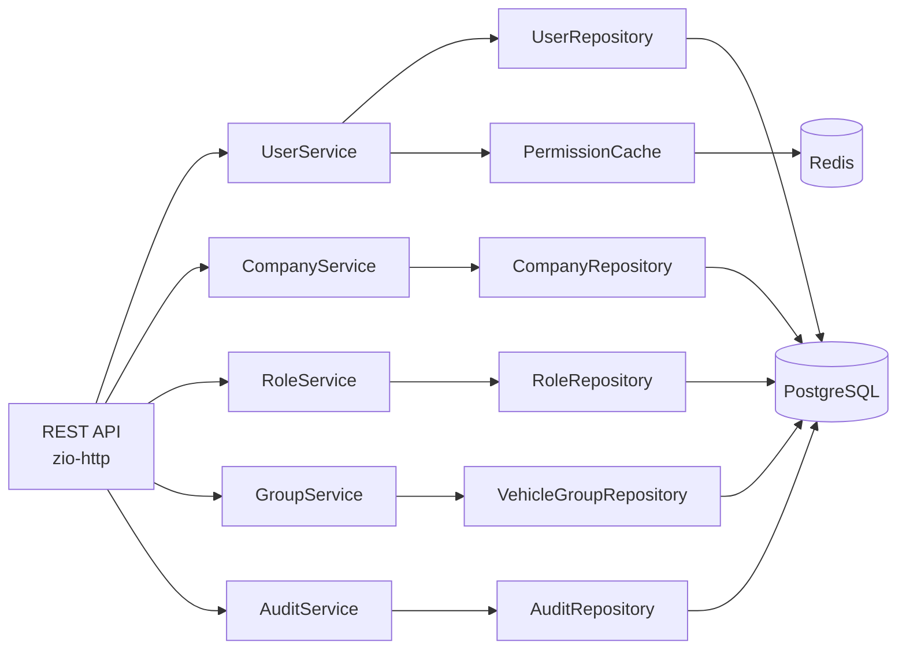

> Тег: `АКТУАЛЬНО` | Обновлён: `2026-03-01` | Версия: `1.0`

# User Service — Архитектура

## Компоненты



## RBAC модель

- 6 системных ролей: super_admin (0), admin (10), manager (20), operator (30), dispatcher (40), viewer (50)
- Пользователь НЕ может назначить роль выше своей (level < свой level)
- 27 разрешений по 8 категориям
- Кэш прав в Redis (TTL 1h), инвалидация при смене роли

## ZIO Layer граф

```
Main → Server → Routes → Services → Repositories → Transactor
                                  → Cache → Redis
```
