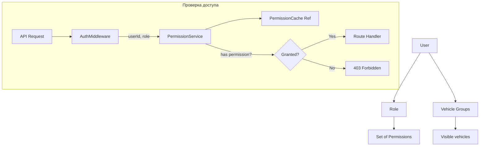

> Тег: `АКТУАЛЬНО` | Обновлён: `2026-03-02` | Версия: `1.0`

# 📖 Изучение User Service

> Руководство по User Service — сервису управления пользователями, ролями и правами доступа.

---

## 1. Назначение

**User Service (US)** — единственный владелец данных о пользователях:
- CRUD пользователей, профили, настройки
- Управление компаниями (регистрация, подписки)
- Роли и права доступа (RBAC)
- Группы ТС (ограничение видимости)
- Аудит действий пользователей
- Хэширование паролей (BCrypt)

**Порт:** 8091. Не использует Kafka.

---

## 2. Архитектура

```
UserRoutes → UserService → UserRepository (PostgreSQL)
ManagementRoutes → CompanyService → CompanyRepository
                → RoleService → RoleRepository
                → GroupService → VehicleGroupRepository
                → PermissionService → PermissionCache (Ref)
                → AuditService → AuditRepository
```

### Компоненты

| Файл | Назначение |
|------|-----------|
| `service/UserService.scala` | CRUD юзеров, профиль, настройки, пароль |
| `service/CompanyService.scala` | CRUD компаний, подписки |
| `service/RoleService.scala` | Управление ролями |
| `service/PermissionService.scala` | Проверка прав доступа |
| `service/GroupService.scala` | Группы ТС (видимость) |
| `service/AuditService.scala` | Журнал действий |
| `cache/PermissionCache.scala` | Кэш прав (Ref) |
| `repository/` | 5 репозиториев: User, Company, Role, VehicleGroup, Audit |

---

## 3. Domain модель

```scala
case class User(
  id: UserId,
  companyId: CompanyId,
  email: String,
  passwordHash: String,       // BCrypt
  firstName: String,
  lastName: String,
  role: Role,
  isActive: Boolean,
  settings: UserSettings,     // Язык, тема, настройки карты
  createdAt: Instant
)

enum Role:
  case SuperAdmin             // Суперадмин (вся система)
  case CompanyAdmin           // Админ компании
  case Dispatcher             // Диспетчер (управление ТС)
  case Viewer                 // Только просмотр

enum Permission:
  case ViewVehicles, ManageVehicles, ViewHistory, ManageGeozones,
       ManageRules, ViewReports, ManageUsers, ManageCompany,
       SendCommands, ViewSensors, ManageIntegrations, ...

case class VehicleGroup(
  id: Long,
  companyId: CompanyId,
  name: String,                // "Грузовой автопарк"
  vehicleIds: Set[VehicleId],
  userAccess: Map[UserId, AccessLevel]  // Кто видит эту группу
)
```

---

## 4. RBAC модель



---

## 5. API endpoints

```bash
# Пользователи
POST   /users                   # Создать пользователя
GET    /users                   # Список юзеров компании
GET    /users/{id}              
PUT    /users/{id}/profile      # Обновить профиль
PUT    /users/{id}/settings     # Обновить настройки
POST   /users/{id}/password     # Сменить пароль
DELETE /users/{id}              

# Компании
POST   /companies               
GET    /companies/{id}          
PUT    /companies/{id}          

# Роли
GET    /roles                   # Список ролей
GET    /roles/{id}/permissions  # Права роли
PUT    /roles/{id}/permissions  # Изменить права

# Группы ТС
POST   /vehicle-groups          
GET    /vehicle-groups          
PUT    /vehicle-groups/{id}     
DELETE /vehicle-groups/{id}     
POST   /vehicle-groups/{id}/access  # Дать доступ юзеру

# Аудит
GET    /audit?from=...&to=...   # Журнал действий

# Health
GET    /health
```

---

*Версия: 1.0 | Обновлён: 2 марта 2026*
